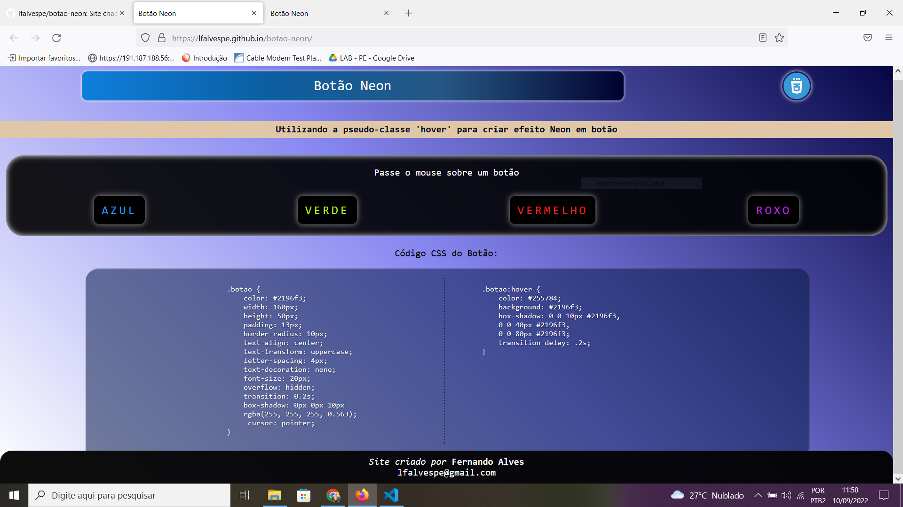

# Botao neon

Site responsivo criado em HTML e CSS utilizando Flexbox e media-queries para explicar o Código CSS utilizado na criação de um botão com efeito neon.

Acesse: http://lfalvespe.github.io/botao-neon

